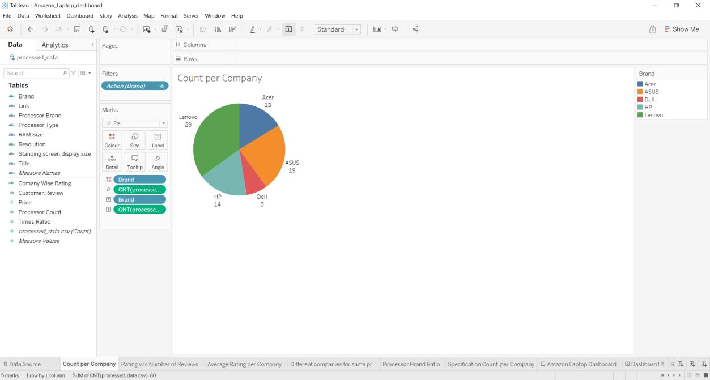
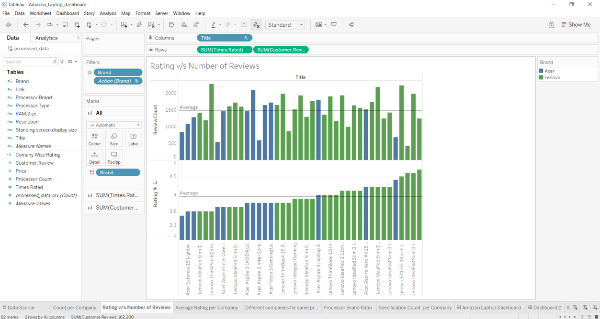
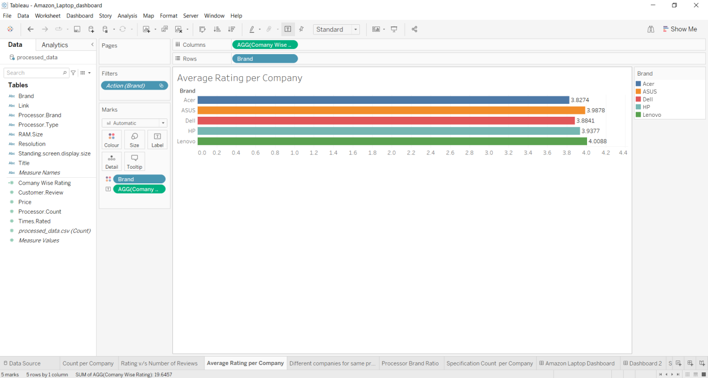
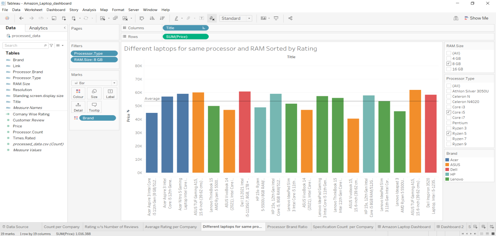
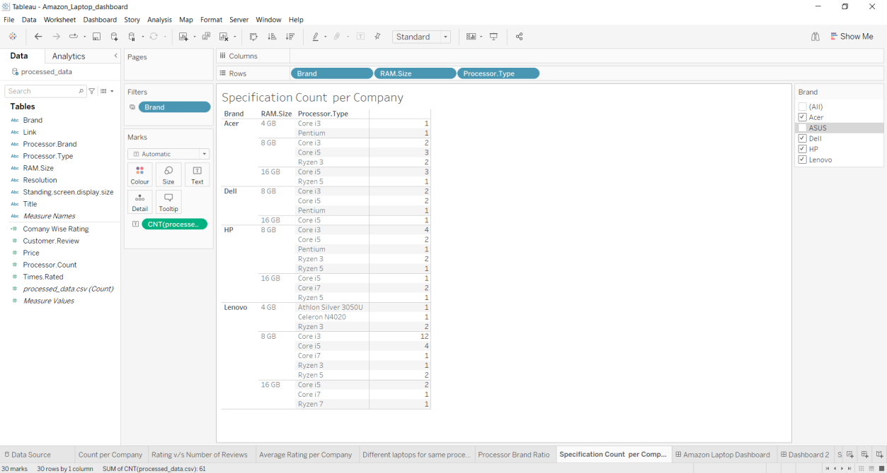

# Amazon Laptop Dashboard
The dashboard is created using Tableau. It shows the data of 80 laptops which is scrapped from amazon.in. The data is collected using using a python script(scrapper.py). The script search for specification and store them in a dictionary after that writes them along with link in a csv file. The csv file is processed using R script(script.r) which take care of missing values and add some dummy columns for better data visualisation. The dashboard contains the following sheets:
- Count per Company
- Rating v/s Number of Reviews
- Average Rating per Company
- Different laptops for same processor and RAM Sorted by Rating
- Specification Count per Company

### Count per Company

This sheet show the count of laptops belonging to different companies/brands. It clearly shows that out of total 80 laptops, 28 belong to Lenovo, 19 to ASUS, 14 to HP, 13 to Acer and 6 to Dell.

### Rating v/s Number of Reviews

This sheet show two stacked bar graphs representing the rating and count of reviews that each item has received. It is filtered on the basis of Brand. Currently, it is showing Lenovo and Acer Laptops. It is clearly visible from the average line in the graphs that out of these two companies, Lenovo has more number of laptops which received the above average rating with considerably good number of reviews.

### Average Rating per Company

This sheet shows the average rating of all the companies considering all reviews and rating. It is clearly depicted by horizontal bar graph that all companies have a good average rating, but Lenovo comes out to be the best among these companies in terms of average rating.

### Different laptops for same processor and RAM Sorted by Rating

This sheet shows different laptops having same RAM and processor configurations and are sorted according to the increasing rating. It is currently showing laptops having 8GB of RAM that are using either Intel Core i5 or AMD Ryzen 5 processor. It clearly shows that for the given hardware requirement, Lenovo Ideapad Slim 3 could be a good choice as it is having price less than the average price of laptops having similar hardware and also it is supported by a good rating as it lies to right hand side of graph.

### Specification Count per Company

This sheet shows the count of laptops belonging to different companies having certain hardware specifications.

